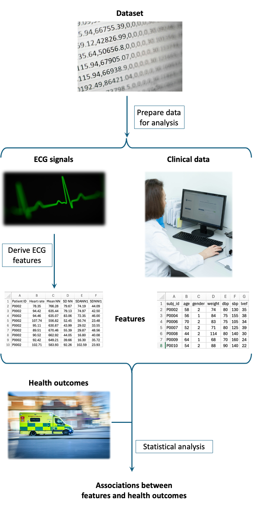

Overview
========

The **Longitudinal ECG Analysis** package is designed to investigate the associations between ECG features and health outcomes.

It provides a processing pipeline to extract features from longitudinal ECG signals and investigate the associations between these features and health outcomes.

Image sources: `Mika Baumeister on Unsplash <https://unsplash.com/photos/white-printing-paper-with-numbers-Wpnoqo2plFA>`_; `Joshua Chehov on Unsplash <https://unsplash.com/photos/a-green-heart-beat-on-a-black-background-oCSol-lBtVA>`_; `Elen Sher on Unsplash <https://unsplash.com/photos/a-woman-sitting-at-a-desk-using-a-computer-0dF7UzD2Yd8>`_; `Ian Taylor on Unsplash <https://unsplash.com/photos/yellow-and-white-van-on-road-during-daytime-4hWvAJP8ofM>`_.

.. _steps:

Steps
-----

The **Longitudinal ECG Analysis** package performs the following steps:

#. :ref:`Generate dataset settings <generating-dataset-settings>`: *create a text file specifying the settings for a particular dataset*
#. :ref:`Curate entire dataset <curating-entire-dataset>`: *curate an entire dataset to get it ready for analysis*
#. :ref:`Generate analysis settings <generating-analysis-settings>`: *create a text file specifying the analysis settings*
#. :ref:`Curate analysis dataset <curating-analysis-dataset>`: *extract and curate a subset of a dataset for analysis*
#. :ref:`Derive signal features <deriving-signal-features>`: *derive features from ECG signals*
#. :ref:`Compile for stats <compiling-for-stats>`: *compile features ready for statistical analysis*
#. :ref:`Perform statistical analysis <statistical_analysis>`: *investigate the associations between features and health outcomes*

.. _methods:

Methods
-------

The toolbox builds on previous research to provide a robust pipeline for investigating associations between ECG features and health outcomes.

First, the toolbox is designed to be compatible with the Heart Hospital dataset, as well as two relevant publicly available datasets: the MUSIC and MC-MED datasets (described :ref:`here <datasets>`). This enables investigations in different patient populations, different clinical scenarios, and short- and long-term health outcomes. Furthermore, it enables possible future extension into multimodal approaches for risk assessment, since the MC-MED dataset contains not only ECG signals, but other physiological signals too.

Second, the toolbox utilises the NeuroKit toolbox to extract features from ECG signals. NeuroKit is perhaps the most widely used open-source toolbox for physiological signal processing. Using NeuroKit not only enables the extraction of many ECG features, but also future-proofs the toolbox by enabling integration with future ECG features which may be implemented in NeuroKit.

Third, the toolbox utilises statistical analysis techniques previously presented in the literature. The statistical analysis was based primarily on that used in `Ramirez et al. <https://doi.org/10.1371/journal.pone.0186152>`_ . This design choice was made for two reasons: the analysis presented in Ramirez et al. was robust, and this enables direct comparison of results between those provided by the toolbox and those reported in the literature (since Ramirez et al. analysed the MUSIC dataset).

Fourth, the toolbox extracts not only ECG features, but also risk markers currently used in clinical practice. This enables the direct comparison of the performance of ECG features to the methods available in current practice. This is particularly valuable for evaluating the potential utility of ECG features.