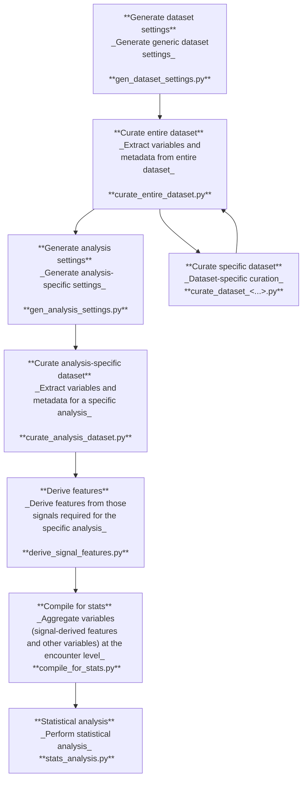

# `longitudinal-ECG-analysis` Processing Pipeline

This flowchart summarises the `longitudinal-ECG-analysis` processing pipeline:

The entire pipeline can be run using **run_demo.py**

Further details of individual modules (corresponding to individual steps in the pipeline) are provided in [modules.md](./modules.md)